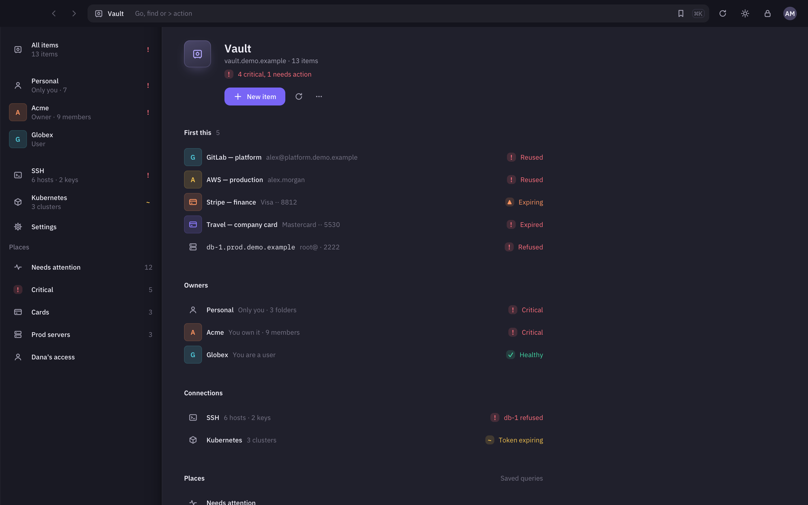
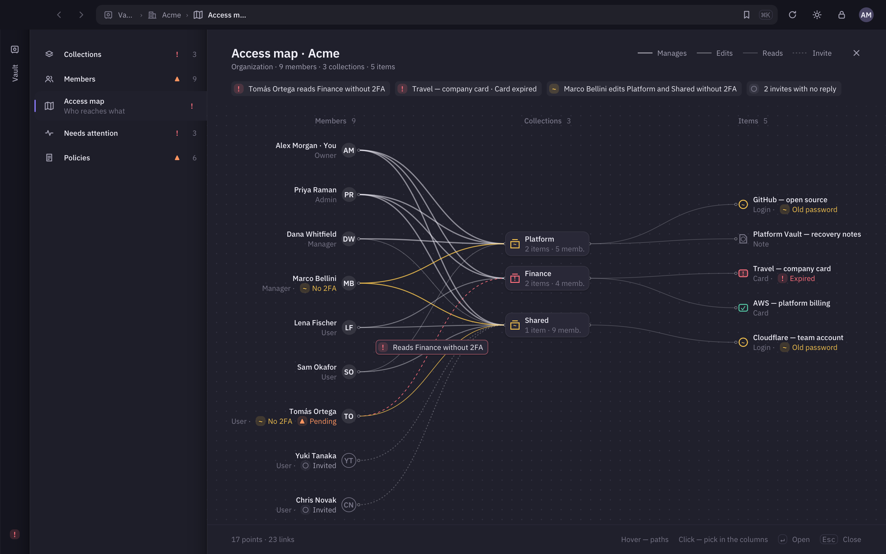
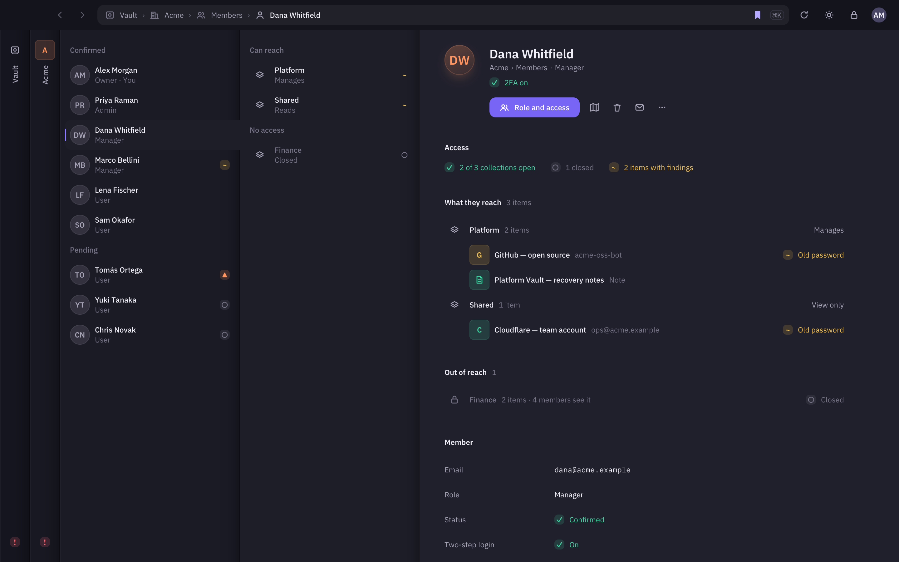
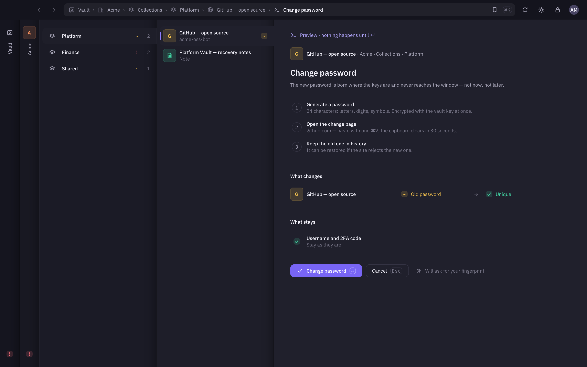
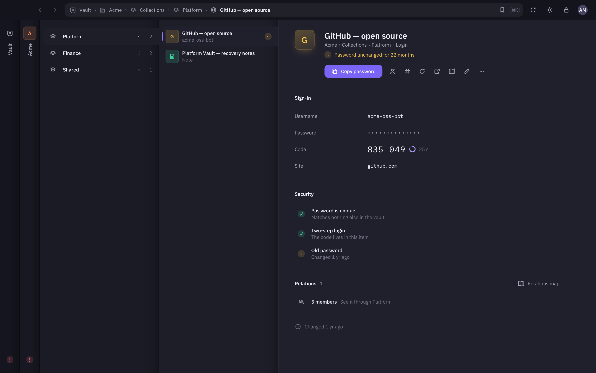
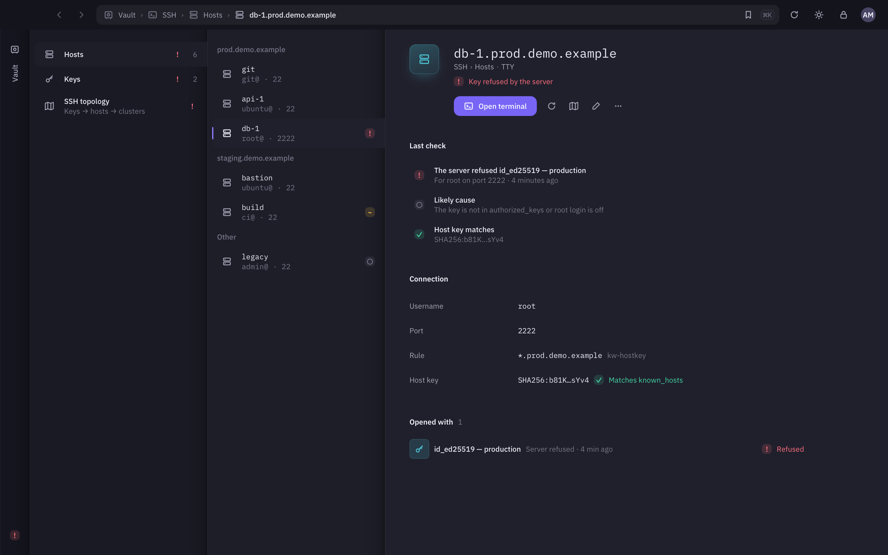
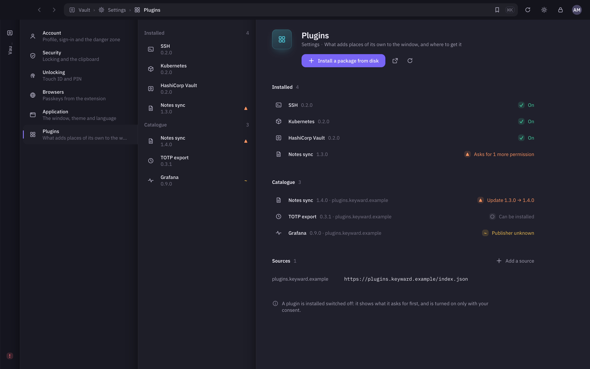
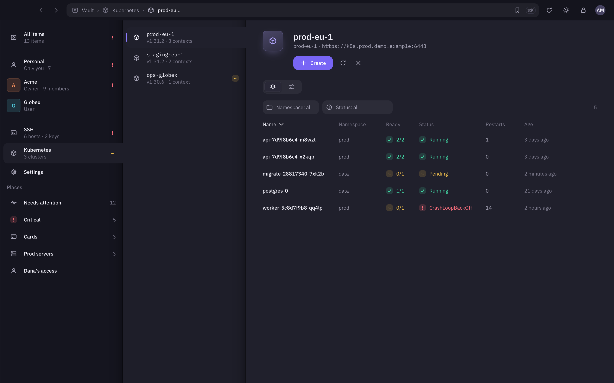
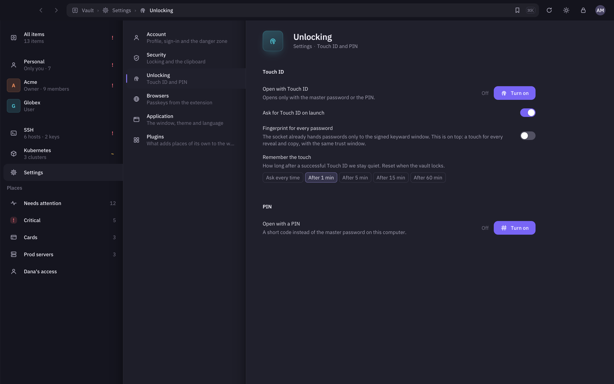
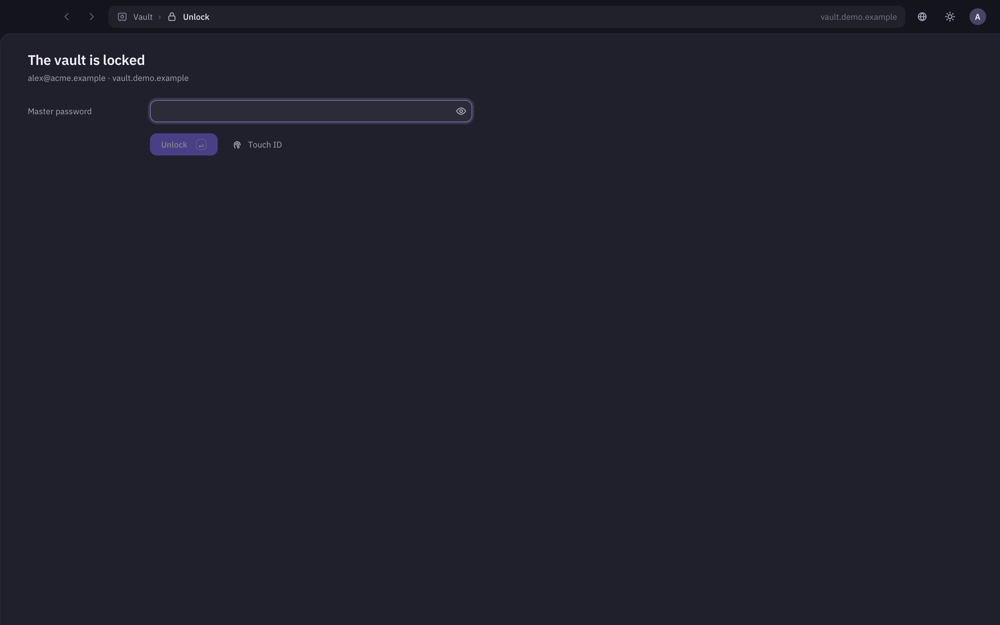

<p align="center">
  
</p>

<h1 align="center">keyward</h1>

<p align="center">
  <strong>Your vault keys, one host at a time.</strong><br>
  A native macOS vault client, per-host SSH agent, and short-lived Vault access broker.
</p>

<p align="center">
  <a href="https://github.com/loperd/keyward/actions/workflows/ci.yml"></a>
  <a href="https://github.com/loperd/keyward/blob/master/LICENSE"></a>
  
  
</p>

> **Experimental software.** keyward handles credentials and private keys. Try it against a test vault first; it has not had an independent security audit.

## Why keyward?

An ordinary SSH agent is host-blind: it offers every loaded key and SSH tries them in turn. That can expose more identities than necessary and often ends in `MaxAuthTries`. keyward stores the rule next to the key in your vault and brings up a dedicated agent socket for the destination, so SSH sees exactly one identity.

```text
Bitwarden / Vaultwarden
          │  encrypted vault
          ▼
   keyward daemon ── host → one key ──► per-host SSH socket ──► ssh
          │
          └── macOS app · Touch ID · plugins · Vault access
```

## One place for access

- Bitwarden, Vaultwarden, and self-hosted compatible servers.
- Logins with server-provided favicons, TOTP and passkeys.
- Secure notes, identities, SSH keys and payment cards.
- Card networks inferred locally from the IIN: Visa, Mastercard, AmEx, Discover, JCB, Diners and UnionPay. The list receives only a network label — never a PAN or its prefix.
- A native macOS experience with Touch ID, clipboard expiry, password generation and a menu-bar presence.

The vault opens on its home: the owners — your personal vault and each organisation — with SSH, Kubernetes, Settings and saved places beside them, and what needs action first.

<p align="center">
  <a href="docs/assets/shots/vault-home.png"></a>
</p>

An organisation's access is drawn as a map: who reaches which collection and which items, with the findings — reading without two-step login, an expired card, invites with no reply — named above it. A member's page says what they reach and what is out of their reach.

<p align="center">
  <a href="docs/assets/shots/access-map.png"></a>
</p>

<p align="center">
  <a href="docs/assets/shots/org-members.png"></a>
</p>

<p align="center"><sub>All screenshots use local, deliberately fake preview data.</sub></p>

### Find anything fast

The line at the top is the path to where you are, and the place to go, find or act: <kbd>⌘</kbd><kbd>K</kbd> focuses it. Typing `>` and a verb shows what it would do first — here changing a password: the steps, what changes, what stays — and nothing happens until <kbd>↵</kbd>. The screenshots are made from the window's stand (`ui/stand`) with made-up data by `node scripts/readme-shots.mjs`.

<p align="center">
  <a href="docs/assets/shots/verb-rotate.png"></a>
</p>

### Records, not just passwords

Cards, identities, secure notes and login details use the same fast list and detail model. Card networks are derived locally from the number; sensitive values remain masked until deliberately revealed.

A login reads as a document: its sign-in with the password masked and the one-time code counting down, its security checks, and its relations — who else sees it and through what.

<p align="center">
  <a href="docs/assets/shots/login-item.png"></a>
</p>

## SSH without key sprawl

Assign a `kw-host` custom field to an SSH-key item, for example:

```text
*.example.net, git.example.com, admin@node1.*:2222
```

The most specific pattern wins: exact host, then the glob with the longest literal suffix, then `*`. A tie is a visible warning, never a guess. keyward currently signs with Ed25519 and can request confirmation per key.

A host's page shows its last check — here a key the server refused, with the likely cause — its connection, the rule that matched it and its host key, and the key it was opened with.

<p align="center">
  <a href="docs/assets/shots/ssh-host.png"></a>
</p>

## Install

The first public builds target **macOS 14+ on Apple silicon**. Until a signed release is published, build from source:

```sh
git clone https://github.com/loperd/keyward.git
cd keyward
npm ci
make install
```

`make install` builds the app and CLI, installs the app in `/Applications` (or `~/Applications`), puts `keyward` in `~/.local/bin`, and starts a per-user LaunchAgent. It deliberately does **not** edit `~/.ssh/config`.

```sh
make status       # installation and daemon state
make uninstall    # removes the app, CLI, and LaunchAgent
make test         # Rust tests plus an SSH smoke test
```

## First connection

```sh
# Configure one Bitwarden/Vaultwarden account.
keyward setup --region self --url https://vault.example.com --email you@example.com
keyward login

# Optional: keep the verified master password behind Touch ID.
keyward remember
keyward unlock --touch-id

# Inspect routes and print the SSH configuration snippet.
keyward hosts
keyward ssh-config
```

Add the printed snippet to `~/.ssh/config` once:

```sshconfig
Match exec "keyward resolve %h %r %p"
  IdentityAgent ~/.keyward/s/%h.sock
  IdentitiesOnly yes
```

## Vault access and plugins

The bundled HashiCorp Vault plugin connects to Vault, works with policies and engines, issues short-lived access, and manages secrets. The Vaultwarden plugin provides an admin view for compatible servers. Plugins are isolated executables with explicit permissions.

Settings › Plugins lists what is installed, what the catalogue offers, its updates and the permissions a plugin asks for. A plugin's screens are drawn by the window itself — here the Kubernetes plugin's pods of a cluster, filtered by namespace and status.

<p align="center">
  <a href="docs/assets/shots/settings-plugins.png"></a>
</p>

<p align="center">
  <a href="docs/assets/shots/kubernetes-pods.png"></a>
</p>

Read the [plugin protocol](docs/plugin-protocol.md) and [plugin registry guide](docs/plugin-registry.md) before writing or publishing a plugin.

## Generate and protect

Settings are split into Account, Security, Unlocking, Browsers, Application and Plugins. Unlocking holds Touch ID — on launch, for every password, and how long a touch is remembered — and the PIN.

<p align="center">
  <a href="docs/assets/shots/settings-unlocking.png"></a>
</p>

A locked vault shows only the gate: the account and server, the master password and Touch ID.

<p align="center">
  <a href="docs/assets/shots/locked.png"></a>
</p>

## Security boundaries

- keyward sets `RBW_PROFILE=keyward`, so it does not overwrite somebody else's `rbw` profile or cache.
- It relies on the cryptographic core from [`rbw`](https://github.com/doy/rbw) rather than implementing vault crypto itself.
- A remembered master password is stored in the macOS Keychain under an ACL requiring user presence. Locking forgets keys and removes every agent socket.
- Network-library tracing stays off even with `KEYWARD_LOG` enabled, to avoid writing login bodies or authorization headers to logs.

RSA/ECDSA signing, OpenSSH session binding and host-key TOFU are planned but not complete. `kw-cert` is displayed today but does not yet issue Vault SSH certificates.

## Development

```sh
npm ci
cargo test --workspace --locked
./scripts/smoke.sh

# Native development window
make run
```

For UI work, the stand in [`ui/stand`](ui/stand) (`npm -w @keyward/stand run dev`) runs the full interface against rich, fake fixtures—no daemon or vault connection required.

## Licence

[MIT](LICENSE) © keyward contributors.
